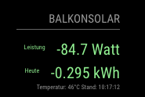

# Shelly-PM

## Description

This is a simple MagicMirror module to display ONE Shelly PM sensor data (temperature and power) on Magic Mirror.

Feel free to extend to fulfill your own needs, This fulfills my needs. See the configuration and some pictures [here](https://github.com/stefanjacobs/MagicMirror).

The module uses the Shelly HT API over LAN to get the sensor data. For details, [check here](https://shelly-api-docs.shelly.cloud/).
For it to work properly, it's best to have a static IP for your Shelly. Since it's using LAN connection, no authentication is needed towards the API.

Feel free to enhance :)

## Screenshot crop



## Prerequisites

- You need to have a MagicMirror up and running, also a [Shelly PM sensor](https://shelly.cloud/) with a fixed IP.
- If you want a language other than `en` or `de` please add it under translations.

## Configuration

Include this (or multiple instances of it) in your config.js file:

```json
{
    module: "MMM-Shelly-PM",
    header: "Shelly-PM",
    position: "top_left",
    config: {
        //Your Shelly PM needs to have a fixed IP (or your LAN must be supporting mDNS)
        ShellyApiPath: "http://192.168.0.149/rpc/Shelly.GetStatus",
        RefreshInterval: "5000" //milliseconds
    }
}
```

## Installing

Go to your MagicMirror directory

```bash
cd modules
git clone https://github.com/stefanjacobs/MMM-Shelly-PM
```

Check out the config.sample.js in the module directory. Copy the content to your config.js and change as necessary. You have to change ShellyApiPath to your device's IP address.

Restart MagicMirror and enjoy.
