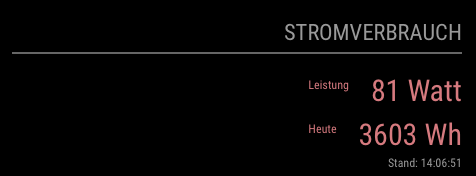

# MMM-Shelly-Pro-3EM

## Description

This MagicMirror module displays Shelly Pro 3EM sensor data (current and today's energy consumption).

This is a fork of (https://github.com/stefanjacobs/MagicMirror) for the Shelly Pro 3EM using only the local network interface.

The module uses the Shelly Pro 3EM API over LAN to get the sensor data. For details, [check here](https://shelly-api-docs.shelly.cloud/).
For it to work properly, it's best to have a static IP for your Shelly.

## Screenshot crop



## Prerequisites

- You need to have a MagicMirror up and running, also a [Shelly Pro 3EM sensor](https://shelly.cloud/) with a known IP.
- If you want a language other than `en` or `de` please add it under translations.

## Configuration

Include this (or multiple instances of it) in your config.js file inside the `modules` array:

```
{
    module: "MMM-Shelly-Pro-3EM",
    header: "Energy Consumption",
    position: "top_right",
    config: {
        // replace <local-ip-of-shelly-pro-3em> with the local (fixed) IP of your Shelly Pro 3EM
        shellyURLAndPath: "http://<local-ip-of-shelly-pro-3em>/rpc/Shelly.GetStatus",
        refreshInterval: "5000", // in milliseconds
        negativeDisplay: true, // default: false, if set to true and you are generating more energy than you use, show values in green without negative sign
        horizontalView: true, // default: true, if set to true displays values next to each other, otherwise below each other
        displayUpdated: true // default: true, if set to true display the time incl. seconds when the data was last received
    }
},
```

## Installing

Go to your MagicMirror directory

```bash
cd modules
git clone https://github.com/thobach/MMM-Shelly-Pro-3EM
cd MMM-Shelly-Pro-3EM
npm install
```

Copy the configuration data from above configuration section to your config.js and change as necessary. You have to change shellyURLAndPath to your device's IP address.

Restart MagicMirror and enjoy.
